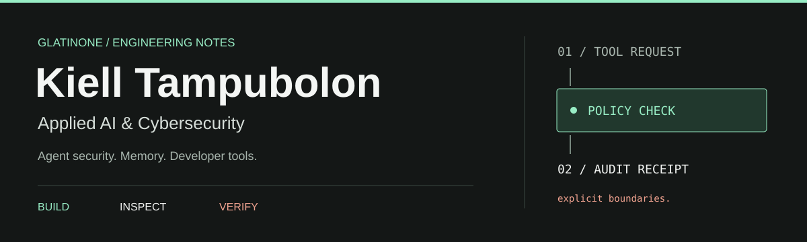

<p align="center">
  
</p>

<p align="center">
  <a href="https://kielltampubolon.id">Portfolio</a> &nbsp;&nbsp;/&nbsp;&nbsp;
  <a href="https://dev.to/kielltampubolon">DEV.to</a> &nbsp;&nbsp;/&nbsp;&nbsp;
  <a href="https://www.linkedin.com/in/kiel-tampubolon/">LinkedIn</a> &nbsp;&nbsp;/&nbsp;&nbsp;
  <a href="https://kielltampubolon.medium.com">Medium</a>
</p>

## Building AI systems you can inspect.

I'm **Kiell**, an applied AI and cybersecurity engineer. I build tools for securing agent actions, making memory explicit, and turning security workflows into runnable software.

My work starts with a practical question: **what happens when the system gets it wrong?** I explore that through policy boundaries, adversarial cases, audit trails, and developer tools.

<!-- DEVTO-FOLLOWERS-COUNT:START -->
<a href="https://dev.to/kielltampubolon"></a>
<!-- DEVTO-FOLLOWERS-COUNT:END -->

## In Focus / Agentic Security Lab

**What should an agent be allowed to do, and how do you prove it respected the boundary?**

[Agentic Security Lab](https://github.com/glatinone/agentic-security-lab) explores that question with a deny-by-default policy boundary for tool calls, runtime enforcement, adversarial cases, and audit receipts.

```text
Agent request  -->  Policy check  -->  Tool action  -->  Audit receipt
                        |
                   Deny by default
```

## Selected Work

| Project | What it does | Area |
| :--- | :--- | :--- |
| **[mcpscan](https://github.com/glatinone/mcpscan)** | Scans MCP servers and agent projects for risky tools, permissions, commands, and secrets before install. | Agent security |
| **[agent-memory-protocol](https://github.com/glatinone/agent-memory-protocol)** | An open protocol and reference implementation for durable, inspectable agent memory. | Agent infrastructure |
| **[ai-safety-compass](https://github.com/glatinone/ai-safety-compass)** | A local-first workspace that turns AI workflow facts into safeguards, hard stops, and review records. | Applied AI |
| **[secops-toolkit-mcp](https://github.com/glatinone/secops-toolkit-mcp)** | Defensive utilities for IOC handling, hashing, CIDR checks, repository checks, and command assessment. | Security tooling |

<details>
<summary><b>More from the workbench</b></summary>

- **[autoreview](https://github.com/glatinone/autoreview)**: AI-powered pull request review in the terminal, with support for multiple model providers.
- **[dev-to-mcp](https://github.com/glatinone/dev-to-mcp)**: Browse DEV.to articles and challenges, and publish authenticated posts through MCP.
- **[human-approval-gate](https://github.com/glatinone/human-approval-gate)**: An Agent Zero plugin that pauses high-risk actions for human approval.
- **[payment-webhook-repair-lab](https://github.com/glatinone/payment-webhook-repair-lab)**: A local lab for retries, idempotency, state protection, and webhook failure recovery.

</details>

## Tools & Approach

<p>
  
  
  
  
</p>

Concrete workflow first. A small runnable implementation next. Then normal paths, adversarial inputs, and documented limits. I care about useful demos and evidence that someone else can reproduce.

## Writing & Collaboration

I write about AI engineering, security, and what I learn while building. Find my articles on **[DEV.to](https://dev.to/kielltampubolon)** and **[Medium](https://kielltampubolon.medium.com)**.

For collaborations around agent security, developer tools, technical documentation, or code-backed demos, connect on **[LinkedIn](https://www.linkedin.com/in/kiel-tampubolon/)**.

---

<sub>Implementation first. Evidence over hype.</sub>
